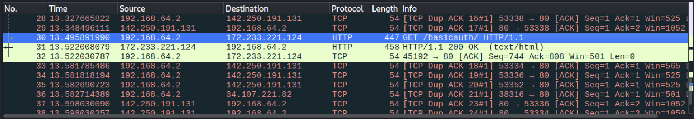
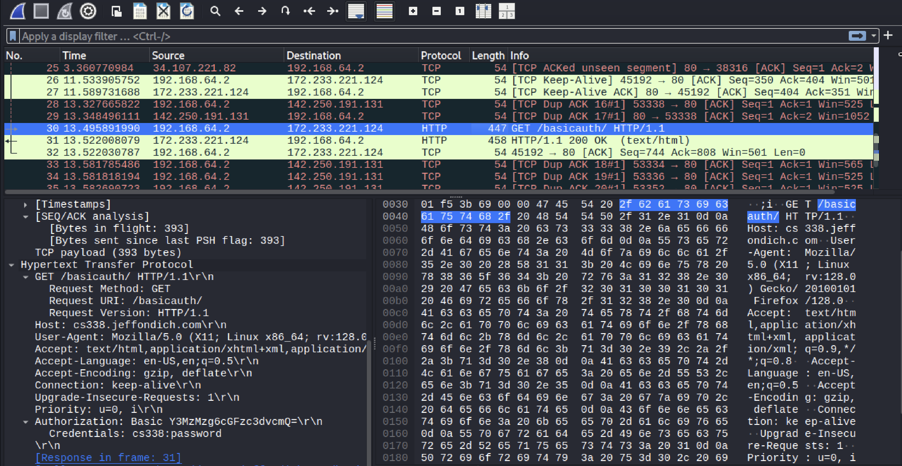
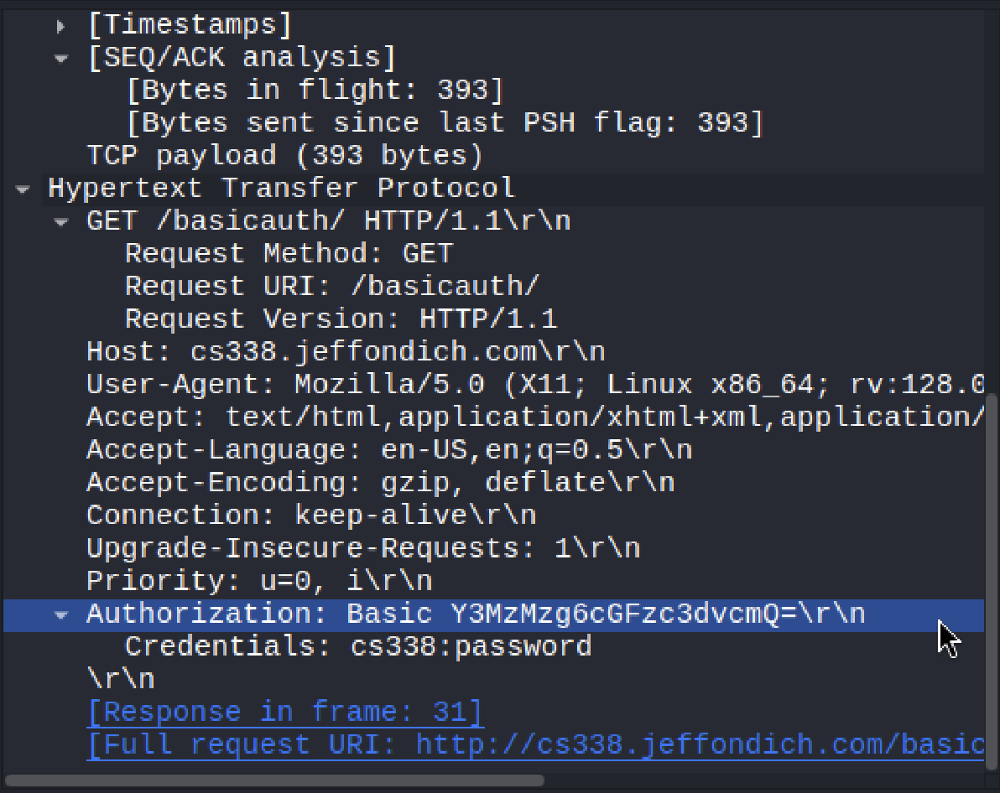

# Feraidon AbdulRahimzai
## CS338 - Basic Auth Assignment
### September 25, 2025

To start off, at this point in the observation, I am using Wireshark for the initial state of running our website and entering the given username and password. 


Right of the bat, as soon as I capture and enter the authentication, I am given access to the files. I do have to mention that in packet 13 of Wireshark we see an unauthorized attempt to the basicauth. It seems a little weird why that would be because at this point I have not yet given it the username and password. However I realized that with the 
```bash 
GET /basicauth/ HTTP/1.1
``` 
command we are intially asking for the basic auth page right out and so we are denied the authorization, hence we get the 401 unauthorized code.

After this we see our client (us) making tcp handshake connection with first the http://cs338.jeffondich.com/ ip address, which is 172.233.221.124, then another ip address, (142.250.191.131), and then it keeps trying to do a tcp handshake with 34.107.221.82 but is not successful in doing so with many attempts until the end of the packets, around 40 packets total.

Moving on, we can see in this screenshot that we once again make an attempt on getting access to basicauth and we are authorized with a code 200 to view the content in the 30th packet.

 

This now also give us the html text with the href's to the other documents listed in the basic auth Index page. While going through the frames specifically, I saw something I wasn't expecting, in the 30th packet when we are authenticating our authorization, I see that our user and password has been saved to Wireshark. Well this probably means that the password is lying somewhere in the activity of the connection/handshake and so in the log of activity itself. This tells me that it is not a safe approach, if the data is being saved. 

As we see in the images below, the 
```bash 
GET /basicauth/ HTTP/1.1
```
command after the correct authentication gives us the html file for the /basicauth/ Index page and as we see in the second image, once we request using GET and the information is recieved after successful authentication. The authenticator saves the password to the activtiy log under **Authorization** and *Credentials*. 

**1.**


**2.**
