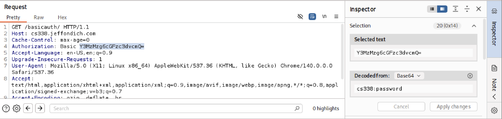

# Feraidon AbdulRahimzai
## CS338 - Basic Auth Assignment
### September 25, 2025

____
**Wireshark Info**
____

To start off, at this point in the observation, I am using Wireshark for the initial state of running our website and entering the given username and password. 


Right of the bat, as soon as I capture and enter the authentication, I am given access to the files. I do have to mention that in packet 13 of Wireshark we see an unauthorized attempt to the basicauth. It seems a little weird why that would be because at this point I have not yet given it the username and password. However I realized that with the 
```bash 
GET /basicauth/ HTTP/1.1
``` 
command we are intially asking for the basic auth page right out and so we are denied the authorization, hence we get the 401 unauthorized code.

After receiving the 401 response, the browser presents the pop-up dialog to the user. The user typing the credentials into that dialog is what causes the browser to send the second GET request, now populated with the Authorization header.

After this we see our client (us) making tcp handshake connection with first the http://cs338.jeffondich.com/ ip address, which is 172.233.221.124, then another ip address, (142.250.191.131), and then it keeps trying to do a tcp handshake with 34.107.221.82 but is not successful in doing so with many attempts until the end of the packets, around 40 packets total.

Moving on, we can see in this screenshot that we once again make an attempt on getting access to basicauth and we are authorized with a code 200 to view the content in the 30th packet.

 

This now also give us the html text with the href's to the other documents listed in the basic auth Index page. While going through the frames specifically, I saw something I wasn't expecting, in the 30th packet when we are authenticating our authorization, I see that our user and password has been saved to Wireshark. Well this probably means that the password is lying somewhere in the activity of the connection/handshake and so in the log of activity itself. This tells me that it is not a safe approach, if the data is being saved. 


As we see in the images below, the 
```bash 
GET /basicauth/ HTTP/1.1
```
command after the correct authentication gives us the html file for the /basicauth/ Index page and as we see in the second image, once we request using GET and the information is recieved after successful authentication. The authenticator saves the password to the activtiy log under **Authorization** and *Credentials*. 

**1.**


**2.**


When I went through the reading on, HTTP's Basic Authentication, [Web page for the HTTP Basic Authentication Scheme](https://datatracker.ietf.org/doc/html/rfc7617), it was interesting to see how the colon (:) was used for the separation of the username from the password. I mention that because in the credentials I can see that the Base64 is already converted for us **from**  **to** . 

As I mentioned, I see how the colon comes into play here. It is separating the username, *cs338* from the password, *password*.


____
**Burpsuite Info**
____
I have now moved on to Burpsuite Community Edition to see what I can make out of it. As soon as I send in requests and move forward with the interception. I am given the Base64 encoding of the username and the password in the *Request* panel and in the inspector. 




I have to cut short my review on this because I have reached a point where there isn't any additional information for me to look at. In the end, I want to say that this process of basic http authentication might not be the safest option to lock up stuff within the browser as authentications are sent over the network and in a unencrypted way where you can easily decode from Base64. In both of the applications I was given the decoded base64 making it super easy for others to access this information.