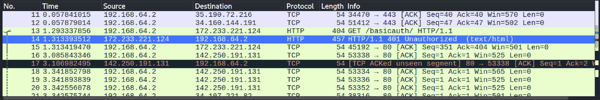

# Feraidon AbdulRahimzai
## CS338 - Basic Auth Assignment
### September 25, 2025

To start off, at this point in the observation, I am using Wireshark for the initial state of running our website and entering the given username and password. 



Right of the bat, as soon as I capture and enter the authentication, I am given access to the files. I do have to mention that in packet 13 of Wireshark we see an unauthorized attempt to the basicauth. It seems a little weird why that would be because at this point I have not yet given it the username and password. However I realized that with the 
```bash 
GET /basicauth/ HTTP/1.1
``` 
command we are intially asking for the basic auth page right out and so we are denied the authorization, hence we get the 401 unauthorized code.

